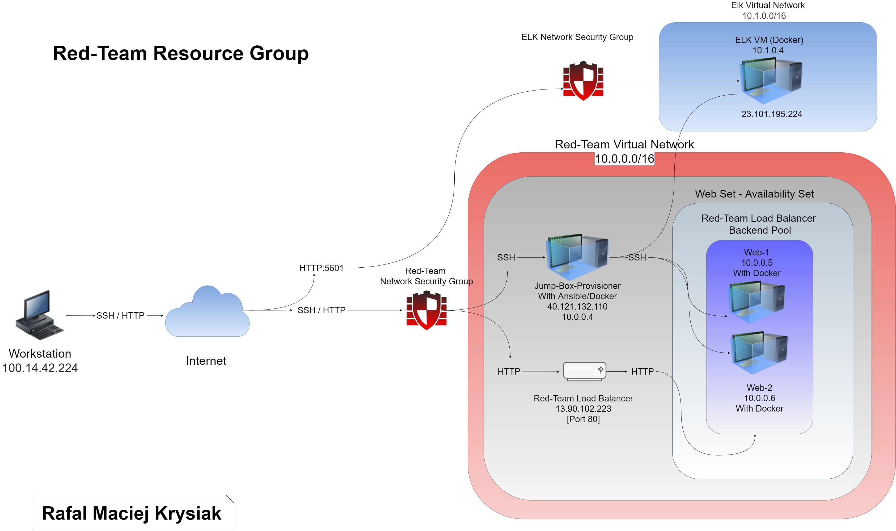
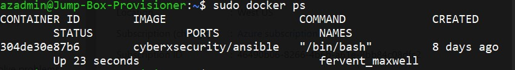

# Rafal Maciej Krysiak ELK Stack

This cloud monitoring system is used in configuring an ELK stack server.

## Automated ELK Stack Deployment Project

The files in this repository were used to configure the network depicted below.





These files have been tested and used to generate a live ELK deployment on Azure. They can be used to either recreate the entire deployment pictured above. Alternatively, select portions of the playbook [install-elk.yml] file may be used to install only certain pieces of it, such as Filebeat.

 ```yml
---
- name: Installing and launching filebeat
  hosts: elk
  become: yes
  tasks:

    # Use command module
  - name: Download filebeat deb
    command: curl -L -O https://artifacts.elastic.co/downloads/beats/filebeat/filebeat-7.6.1-amd64.deb

    # Use command module
  - name: Install filebeat deb
    command: dpkg -i filebeat-7.6.1-amd64.deb

    # Use copy module
  - name: Drop in filebeat.yml
    copy:
      src: /etc/ansible/files/filebeat-config.yml
      dest: /etc/filebeat/filebeat.yml
 
    # Use command module
  - name: Enable and configure system module
    command: filebeat modules enable logstash

    # Use command module
  - name: Setup filebeat
    command: filebeat setup

    # Use command module
  - name: Start filebeat service
    command: sudo service filebeat start
```

This document contains the following details:
- Description of the Topologu
- Access Policies
- ELK Configuration
  - Beats in Use
  - Machines Being Monitored
- How to Use the Ansible Build


### Description of the Topology

The main purpose of this network is to expose a load-balanced and monitored instance of DVWA, the Damn Vulnerable Web Application.

Load balancing ensures that the application will be highly available, in addition to restricting traffic to the network.
Load balancers protect against DDoS attacks by shifting the attack traffic from  a corporate server to public one. The jumpbox protects the availability. 


Integrating an ELK server allows users to easily monitor the vulnerable VMs for changes to the logs and system traffic.
Filebeat watches for log files and log events. Filebeat is a lightweight shipper for forwarding and centralizing log data. Installed as an agent on your servers, Filebeat monitors the log files or locations that you specify, collects log events, and forwards them either to Elasticsearch or Logstash for indexing.

Metricbeat is a lightweight shipper that you can install on your servers to periodically collect metrics from the operating system and from services running on the server. Metricbeat takes the metrics and statistics that it collects and ships them to the output that you specify, such as Elasticsearch or Logstash.

The configuration details of each machine may be found below.

| Name       | Function      | IP Address    | Operating System |   |
|------------|---------------|---------------|------------------|---|
| Jump Box   | Gateway       | 10.0.0.4      | Linux            |   |
| Web-1      | UbuntuServer  | 10.0.0.5      | Linux            |   |
| Web-2      | UbuntuServer  | 10.0.0.6      | Linux            |   |
| ElkVM      | UbuntuServer  | 10.1.0.4      | Linux            |   |


### Access Policies

The machines on the internal network are not exposed to the public Internet. 

Only the Jump-Box-Provisioner machine can accept connections from the Internet. Access to this machine is only allowed from the following IP addresses:
100.14.42.224

Machines within the network can only be accessed by Jump-Box through SSH 
Jump-Box 10.0.0.4

A summary of the access policies in place can be found in the table below.

| Name     | Publicly Accessible | Allowed IP Addresses |
|----------|---------------------|----------------------|
| Jump Box | Yes                 | 40.121.132.110       |
| Web-1    | No                  | 10.0.0.5             |
| Web-2    | No                  | 10.0.0.6             |
| ElkVM    | No                  | 10.1.0.4             |


### Elk Configuration

Ansible was used to automate configuration of the ELK machine. No configuration was performed manually, which is advantageous because you can put a command from multiple servers into a single plabook. 

The playbook implements the following tasks:

- ... [install docker io]
- ... [install pyton pip] 
- ... [install docker]
- ... [install systemctl -w vm.max_map_counts=26144]
- ... [install docker module]
- ... [install virtual memory]
- ... [use more memory]
- ... [download and launch docker container]


The following screenshot displays the result of running `docker ps` after successfully configuring the ELK instance.



### Target Machines & Beats
This ELK server is configured to monitor the following machines:

Web-1 10.0.0.5
Web-2 10.0.0.6

We have installed the following Beats on these machines:

Filebeat and Metricbeat on Web-1 and Web-2 VM

These Beats allow us to collect the following information from each machine:

Filebeat will collect the changes made to a log. Filebeat monitors the log files or locations specified by a user.

Metricbeat will collect metric data and statistics.

### Using the Playbook
In order to use the playbook, you will need to have an Ansible control node already configured. Assuming you have such a control node provisioned: 

SSH into the control node and follow the steps below:
- Copy the yml file to ansible folder.
- Update the config file to include remote users and ports.
- Run the playbook, and navigate to Kibana to check that the installation worked as expected.


- _Which file is the playbook? .yml filebeat config file Where do you copy it? /etc/ansible/hosts

- _Which file do you update to make Ansible run the playbook on a specific machine? How do I specify which machine to install the ELK server on versus which to install Filebeat on? 

Edit etc host file to webservers/elk server ip addresses. /etc/ansible/hosts

By editing the /etc/ansible/hosts file with the appropriate addresses. 

- _Which URL do you navigate to in order to check that the ELK server is running?

http://23.101.195.224:5601/app/kibana

_As a **Bonus**, provide the specific commands the user will need to run to download the playbook, update the files, etc._

anisble-playbook[name_of_playbook.yml]

